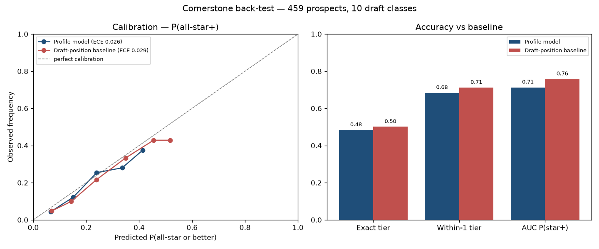

# cornerstone

**An agentic, uncertainty-aware player-development and roster-fit projection system, built around AJ Dybantsa and the Washington Wizards rebuild.**

Cornerstone is a *decision-support-under-uncertainty* system. The product
question it answers: **"AJ Dybantsa is the Wizards' new cornerstone — how is he
likely to develop, and how should the team build around him?"**

It foregrounds four skills that are distinct from typical RAG/retrieval work:

1. **Agentic orchestration** — an autonomous agent that plans a multi-step
   analysis and calls the models below as tools _(Phase 6)_.
2. **Probabilistic modeling with uncertainty** — outcomes as calibrated
   distributions, not point predictions _(Phase 3)_.
3. **Rigorous back-testing** — leakage-aware validation against real draft
   history with calibration metrics _(Phase 4)_.
4. **Quantitative modeling** — embedding-based historical comparables and
   trajectory modeling _(Phase 2)_.

---

## Architecture (target)

```
            ┌─────────────────────────────────────────────────────┐
            │                   AGENT (Phase 6)                     │
            │  plans → calls tools → interprets → synthesizes report│
            └───────────┬───────────────┬───────────────┬──────────┘
                        │               │               │
              get_comparables       project        evaluate_fit
              (Phase 2)           (Phase 3)         (Phase 5)
                        │               │               │
            ┌───────────┴───────────────┴───────────────┴──────────┐
            │        Phase 1 data pipeline → versioned dataset      │
            │  BBRef / SRef  →  fetch+cache → parse → clean → join  │
            └───────────────────────────────────────────────────────┘
                         back-tested by  Eval (Phase 4)
                         served through   API + React (Phase 7)
```

See [`ARCHITECTURE.md`](ARCHITECTURE.md) for module responsibilities and data flow.

## Build status

| Phase | What | Status |
|-------|------|--------|
| 0 | Scaffolding | ✅ done |
| 1 | Data pipeline (fetch → clean → join → version) | ✅ done |
| 2 | Comparables engine (embedding similarity) | ✅ done |
| 3 | Probabilistic outcome model | ✅ done |
| 4 | Back-testing / calibration | ✅ done |
| 5 | Roster-fit engine | ✅ done |
| 6 | Agentic orchestration | ⏳ planned |
| 7 | React frontend + API | ⏳ planned |
| 8 | Polish & writeup | ⏳ planned |

---

## Quickstart

Requires Python ≥ 3.11 and [`uv`](https://docs.astral.sh/uv/).

```bash
uv sync --extra dev        # install
make data-sample           # quick 2-year build (~2 min) to verify the pipeline
make data                  # full 2003-2022 universe (first run ~1.5-2 hr; cached after)
make dybantsa              # build AJ Dybantsa's pre-draft profile row
make comparables           # Dybantsa's top historical analogs (Phase 2)
make project               # Dybantsa's probabilistic projection (Phase 3)
make backtest              # leakage-free back-test + calibration plot (Phase 4)
make skills                # scrape current-season NBA skill profiles (Phase 5)
make roster-fit            # Wizards roster fit around Dybantsa (Phase 5)
make test                  # unit tests
```

Outputs land in `data/processed/` as committed `.parquet` + `.csv`:

| File | Description |
|------|-------------|
| `prospect_features.*` | Pre-draft features, **no leakage** (draft slot, age, measurements, final college season). |
| `realized_outcomes.*` | Realized NBA outcomes (WS/BPM/VORP, early-career trajectory) + a tier label. |
| `prospects.*` | The two joined on `player_id`. |
| `dybantsa.*` | AJ Dybantsa's row, identical schema to `prospect_features`. |

Full column reference: [`pipelines/data_dictionary.md`](pipelines/data_dictionary.md).

### Reproducibility

`data/raw/` (cached HTML) is git-ignored and regenerable; the cleaned
`data/processed/` dataset is committed, so the project is reproducible offline.
Re-running any build hits the cache and is deterministic.

## Back-test results (Phase 4)

Leakage-aware **expanding-window** validation: every draft class is projected
using **only players drafted before it**, then compared to what actually
happened. The same protocol scores a **draft-position baseline** (how players
taken near each slot really turned out) so we can see whether the profile model
adds value. Reproduce with `make backtest`.

**459 prospects across 10 draft classes (2010–2019):**

| Metric | Profile model | Draft-position baseline | Combined |
|--------|:---:|:---:|:---:|
| Within-1-tier accuracy | 0.68 | 0.71 | — |
| P(all-star+) AUC | 0.71 | 0.76 | **0.76** |
| P(all-star+) calibration (ECE ↓) | **0.026** | 0.029 | 0.050 |
| Career-VORP ranking (Spearman ↑) | 0.31 | 0.36 | **0.37** |

**Honest read:** draft position is a strong baseline that profile stats alone
don't beat — but the profile model is **better calibrated** (ECE 0.026 vs
0.029), and **combining profile + draft slot beats draft slot alone** on both
ranking (Spearman 0.36 → 0.37) and star detection (AUC 0.758 → 0.763). The
model adds independent, if modest, signal. No false precision: college
box-score profiles are genuinely weak predictors, which is exactly why the
projections carry wide, explicit uncertainty.



**Limitations** (stated honestly): small early-cohort samples; survivorship and
era effects; training uses earlier cohorts' eventually-realized careers (fair to
both model and baseline). See `eval/backtest.py` for the protocol.

## Data sources

Public, scraped politely (≤ ~18 req/min, cached aggressively):

- [Basketball Reference](https://www.basketball-reference.com) — drafts, NBA
  careers, advanced stats.
- [Sports Reference (College)](https://www.sports-reference.com/cbb/) —
  pre-draft college production.

## Honesty guardrails

No false precision (projections are explicitly probabilistic), no leakage in the
back-test (draft-time-available data only), and openly stated limitations
(sample size, survivorship, era effects). See the data dictionary's limitations
section.

## License

MIT — see [LICENSE](LICENSE).
